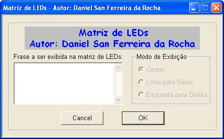

# Fortran Study

> _My first programs made in Fortran during the time I was a physics monitor in high school (Electronics Technician course, between 2007 and 2010)._

All these programs were made in Windows XP, and for the compilation it was used Compaq Visual Fortran.

## Usage

To run a program it is necessary to open the `.dsw` file (Project Workspace).

## Interesting programs

Most programs are CLI mode, but some have 2D shapes or a simple GUI.

> **To see the graphic programs in action go to the [Resources.md](Resources.md) file.**

### LED Matrix (M_LED_Ver10)

This is the project that I consider to be the most complex project I have done during this period of my life. His idea came about because of my need to create some way to update the text shown on the LED matrix sign that I designed using ISIS software (Proteus - Labcenter). And as my computer programming skills were limited at the time, this was the way I managed to partially solve my need.

> The program expects the text to be shown on the sign, when the OK button is clicked, a file `Fase.asm` is created following the pattern expected by the program written for the PIC.
> Then the program "makes an external call" to the "MPASM" compiler, which compiles all `.asm` files into a `.hex` file which is used for simulation in ISIS or can be "programmed" into PIC.

### Graphic programs:

- aula
- CI 555
- estudo1
- icon
- Pitagoras

### 2D Graphic:

- anima
- estudo
- ian
- Jogo da Velha (casa)
- rascunho
- rascunho1
- teste
- teste1
- teste2
- teste quadradinho
- graf 2d
- graf 3d
- Usar mouse
    - mouse
    - mouse2
    - mouse3
    - mouse4
