# Resources

## LED Matrix (M_LED_Ver10)

## Graphic programs:

### aula

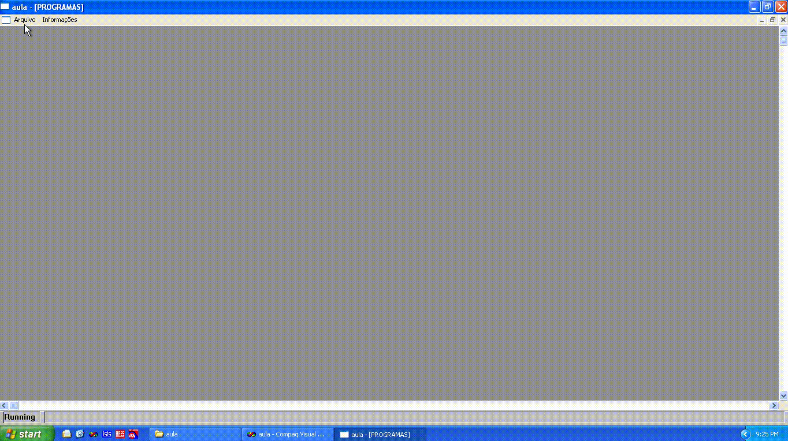

### CI 555

### estudo1

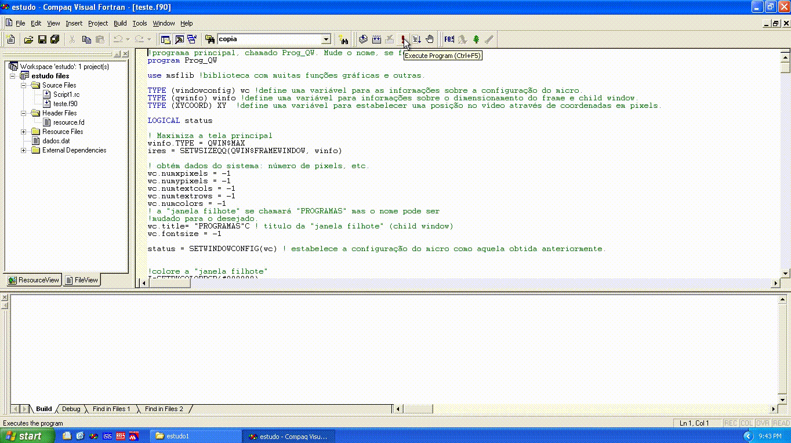

### icone

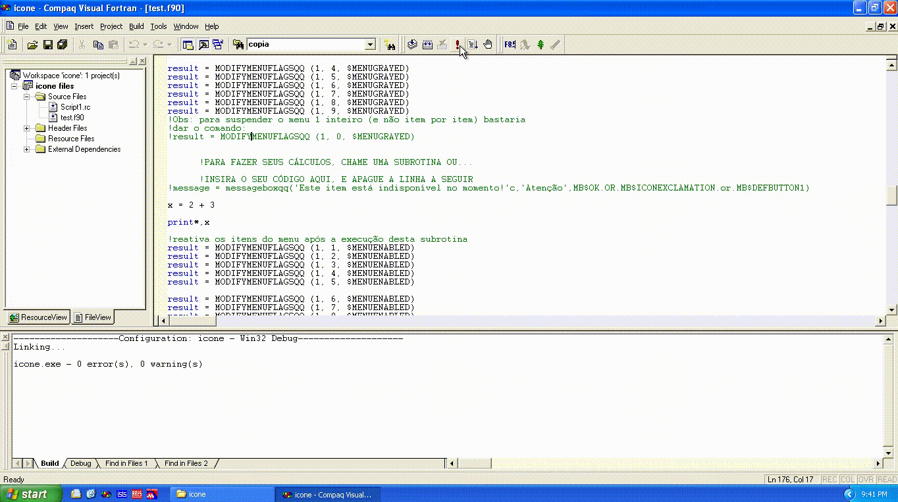

### Pitagoras

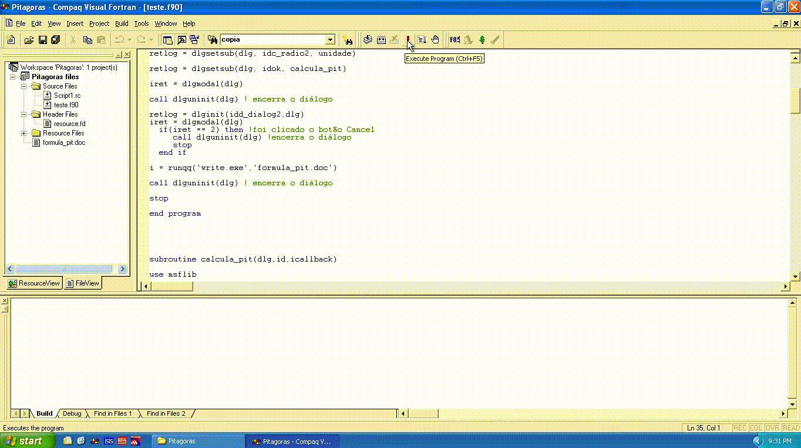

## 2D Graphic:

### anima

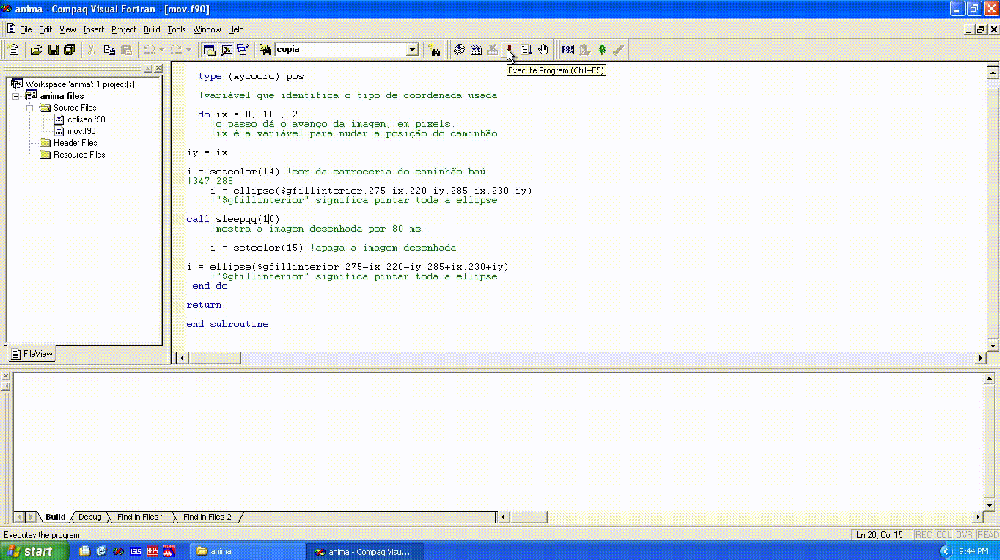

### estudo

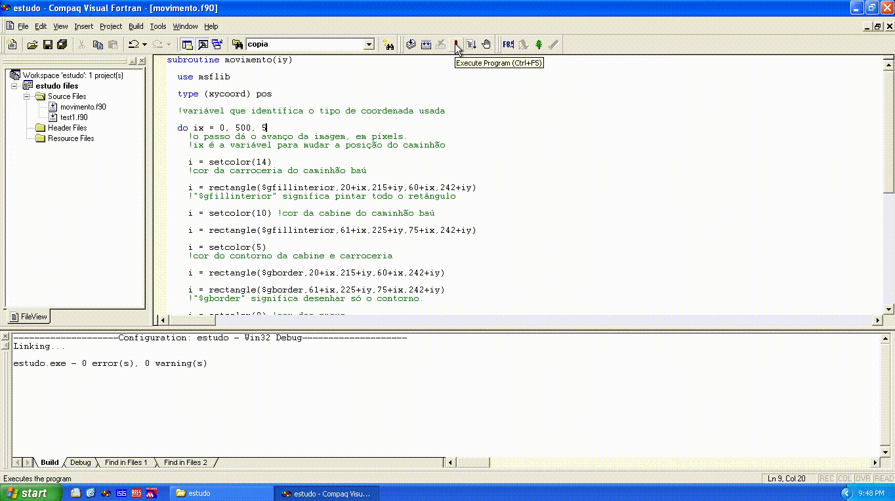

### ian

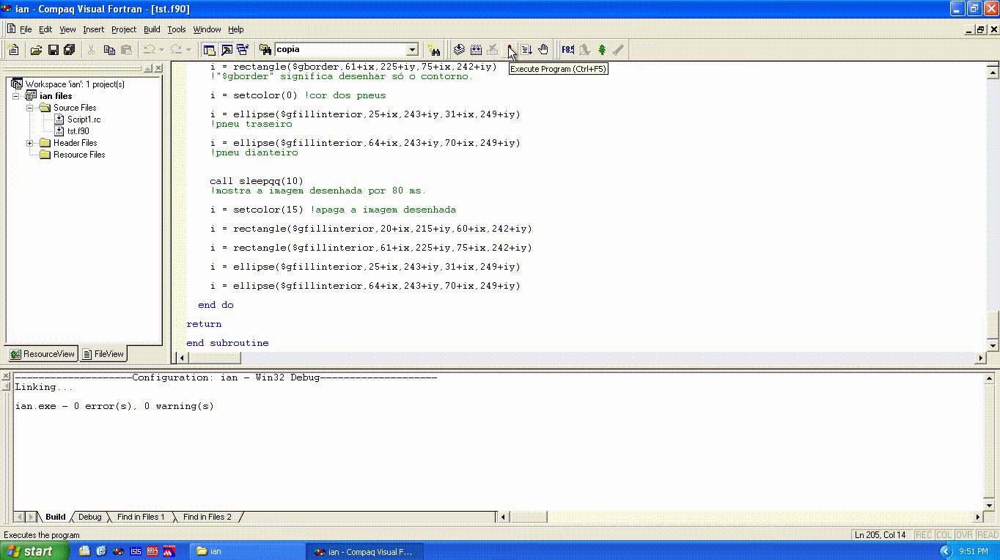

### Jogo da Velha (casa)

### rascunho

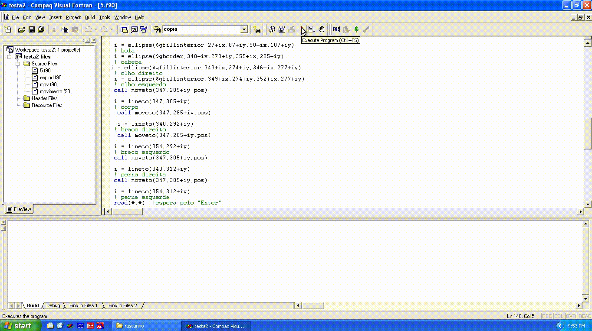

### rascunho1

### teste

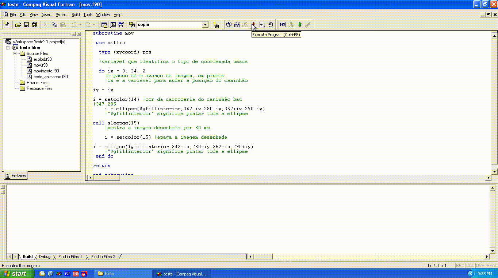

### teste1

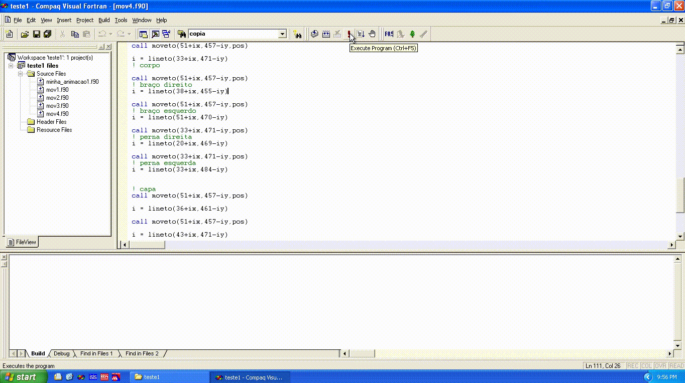

### teste2

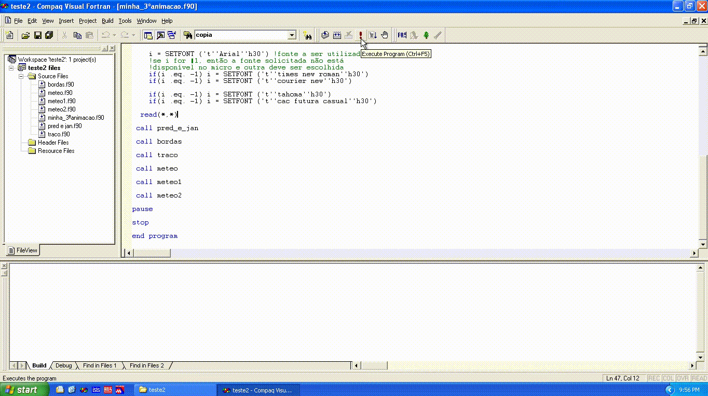

### teste quadradinho

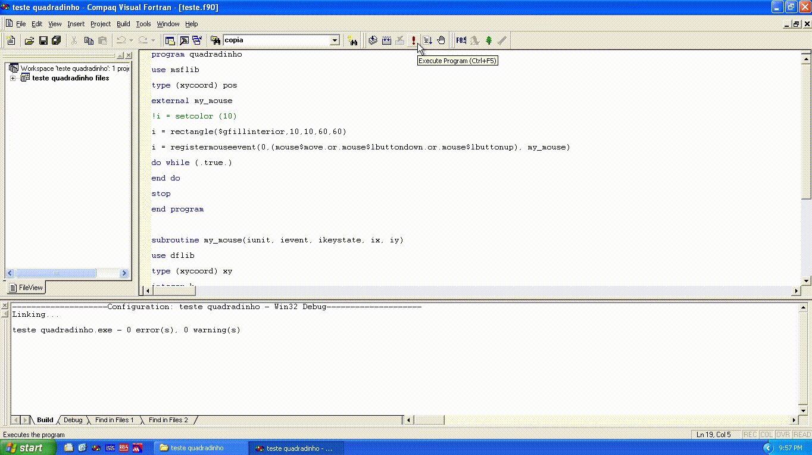

### graf 2d

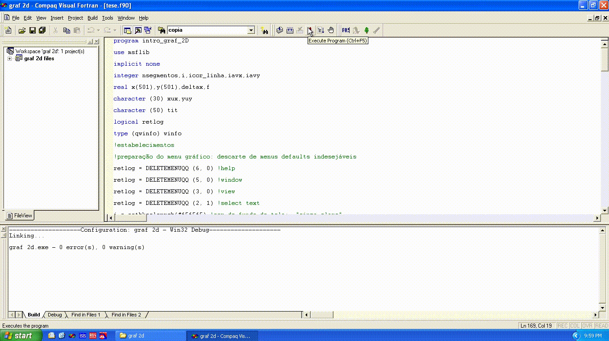

### graf 3d

### Usar mouse

#### mouse

#### mouse2

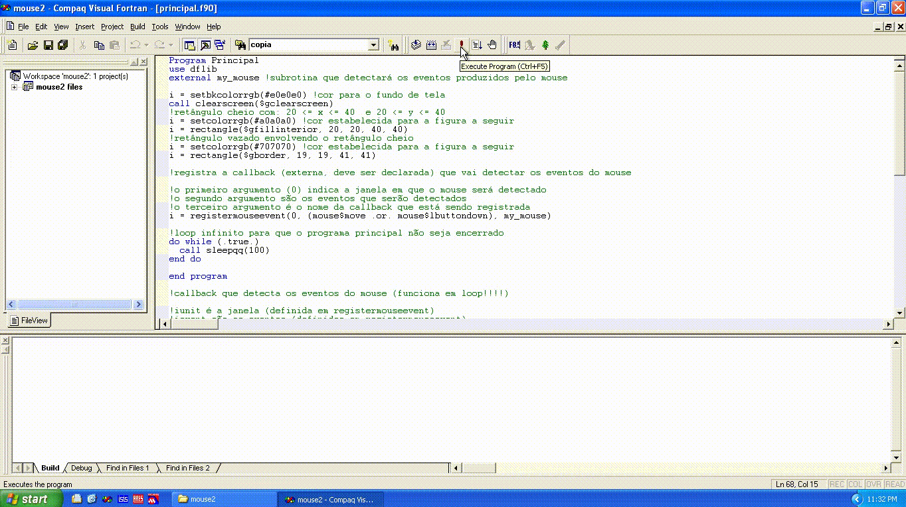

#### mouse3

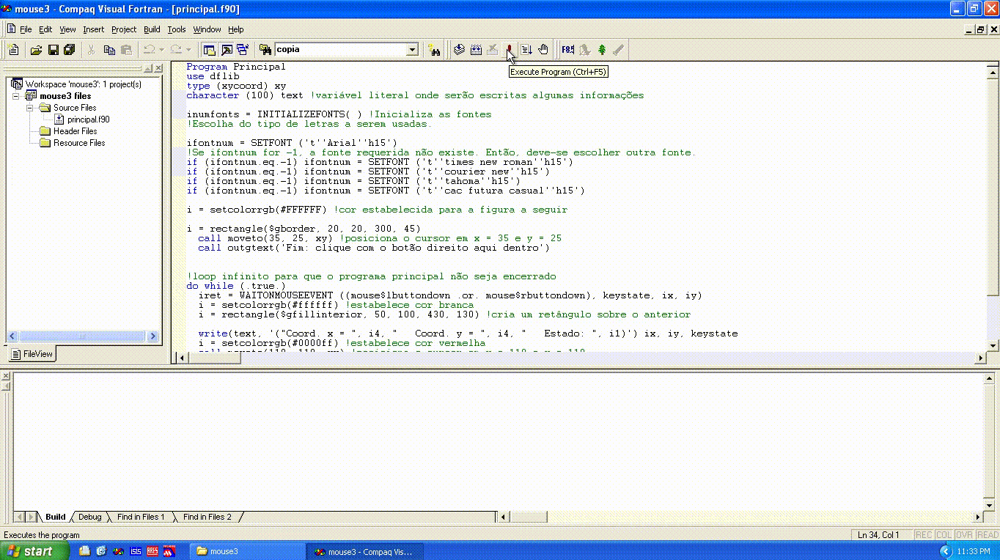

#### mouse4

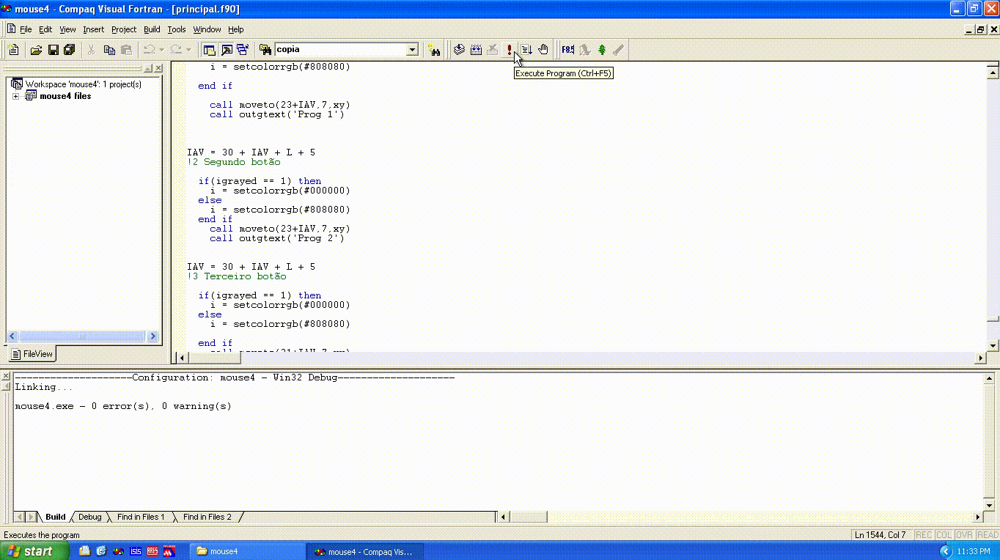
