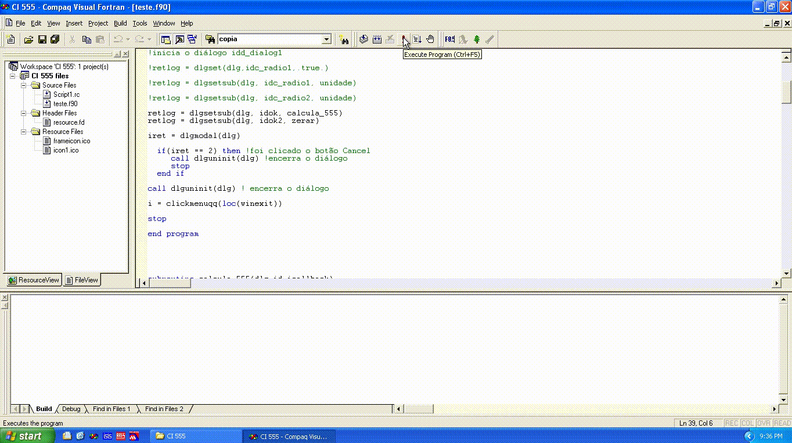
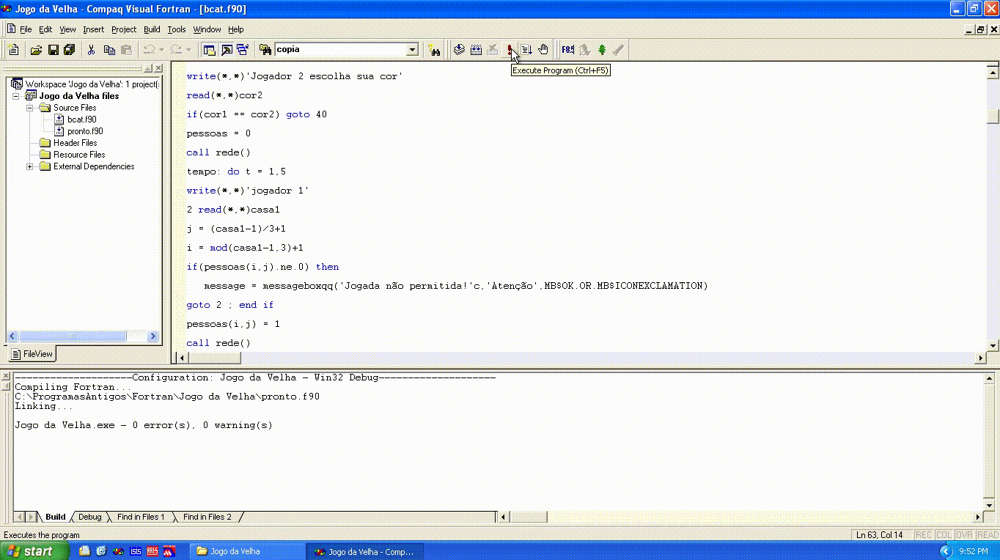
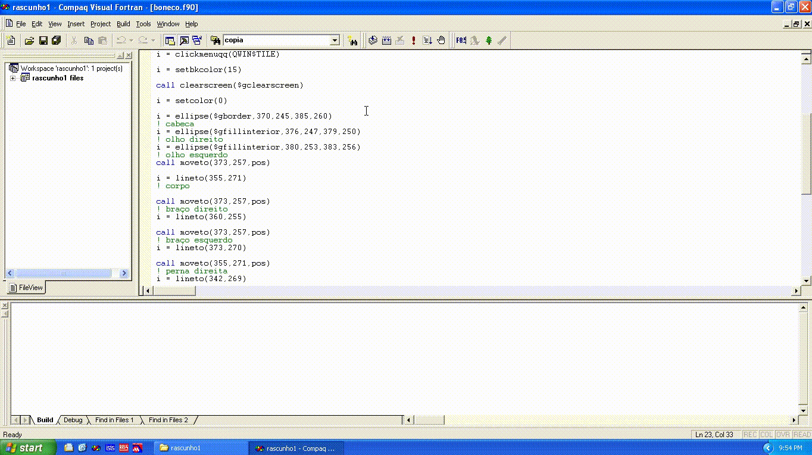
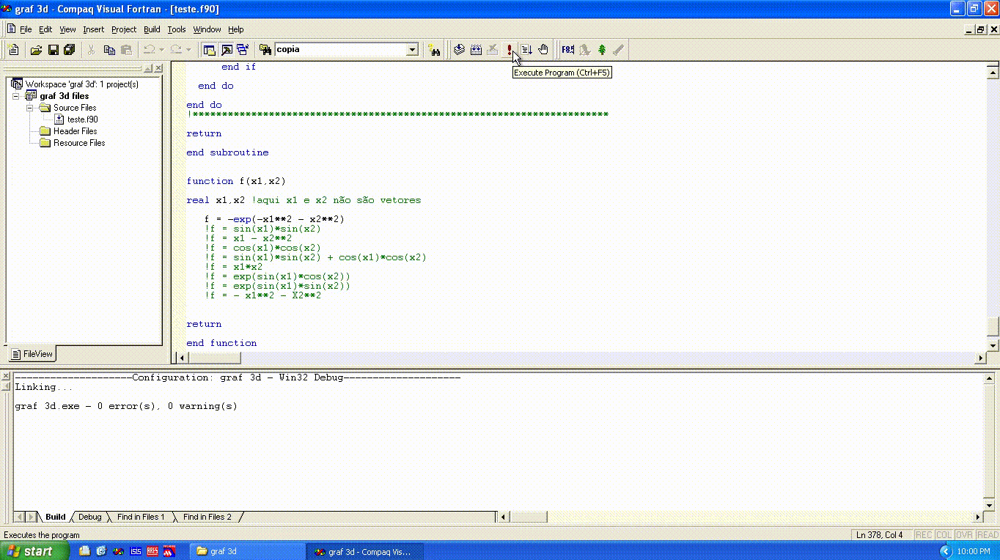
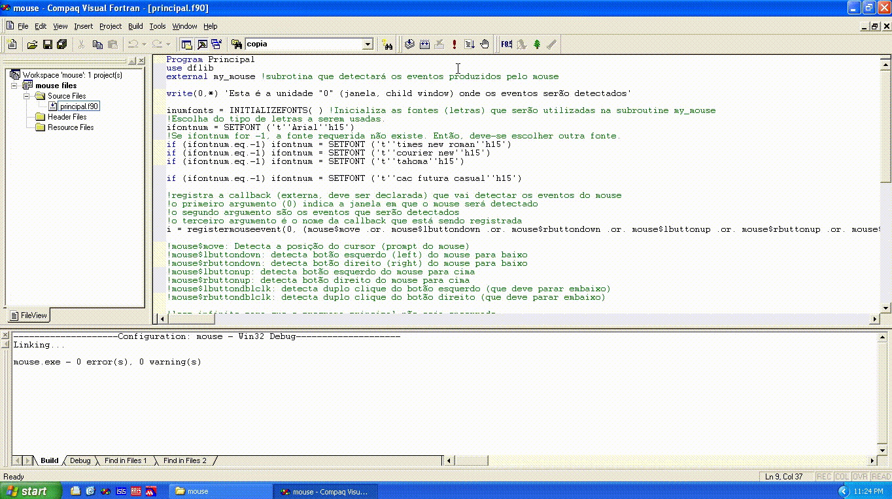

# Resources

## LED Matrix (M_LED_Ver10)

## Graphic programs:

### aula

### CI 555

### estudo1

### icone

### Pitagoras

## 2D Graphic:

### anima

### estudo

### ian

### Jogo da Velha (casa)

### rascunho

### rascunho1

### teste

### teste1

### teste2

### teste quadradinho

### graf 2d

### graf 3d

### Usar mouse

#### mouse

#### mouse2

#### mouse3

#### mouse4

